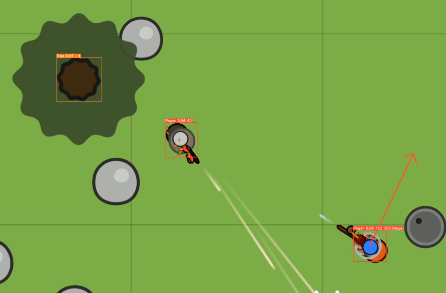
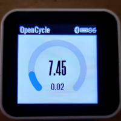
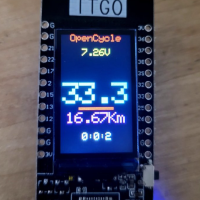
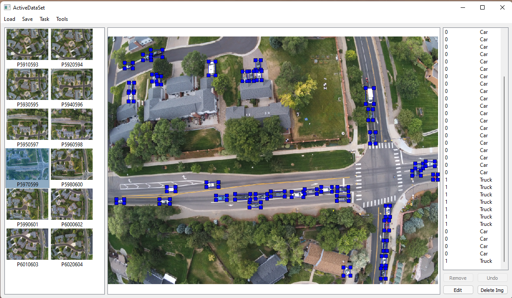
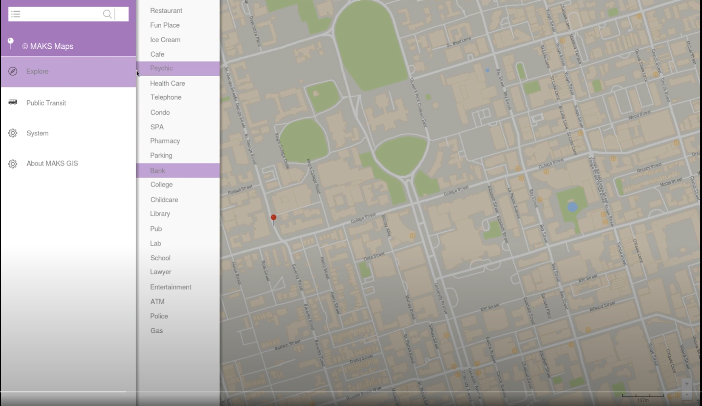
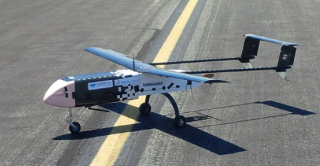

## Education
### University of Toronto
(Sept 2015 - May 2020) \
B.A.Sc. in Computer Engineering

## Skills
### Computer programming:
- **Python**: PyTorch, OpenCV, PySide, uPython
- **C/C++**: Qt, Embedded driver
- **Assembly**
- **More**: Ruby (on Rails), NSIS, CSS, RUST, JavaScript, MATLAB

### Digital system HDL:
- System Verilog

## Work experience
### *Software Application Engineer* at Intel
(May 2022 - Present)
- Programmable Solution Group
- HLD team

### *Software Engineer* at Drone Delivery Canada Corp.
(May 2020 - May 2022)
- Internal infrastructures
- Detection and avoidance systems
- Robotic embedded systems

### *Co-op Software Engineer* at Drone Delivery Canada Corp.
(May 2018 - August 2019)
- Flight control and diagnostic system
- Software integrations

## Projects
### [Surviver](https://github.com/KevinUTAT/surviver_dot_IO)
\
A “Cheat” for the popular web game Surviv.io. \
The program uses YOLO and SORT to recognize and track element on screen (players, trees, etc.) \
and autofiring based on player locations, speed, and obstacles in between.

### [Open Cycle](https://github.com/KevinUTAT/OpenCycle)
 \
Microcontroller-based open-source cycling computer. Support ESP32 systems,
BLE speedometer and GPS. \
In microPython and C++ (for TWatch platform)

### [Active Dataset](https://github.com/KevinUTAT/active_data_set)
\
Computer vision data labeling program with a focus on active learning. \
It provides basic class labeling and also allows quickly screening and modifying of existing labels (that might be auto generated) with some automatic label quality checkers.\
With a “Task” system to streamline workflow of labelling so that a large labelling task can be broken down to sessions and clients to distribute the workload.

### [Geographic Information System](https://www.youtube.com/watch?v=L7z_F1HgqtQ&ab_channel=KevinXu)

Geographic Information System based on OSM database in C++. \
With graphical user interface and capability of solving pathfinding and travelling courier problem. \
ECE297 project.

### University of Toronto Explorer 2B
 \
Fixed wing Unmanned Aerial System for University of Toronto Aerospace Team. \
Equipped with automatic flight controller, computer vision payload system and long-range communication systems. \
Project achievement:
- Unmanned System Canada Student UAS Competition: 1st place Overall (2017)
- Association for Unmanned Vehicle Systems International Competition: 2nd place Mission Performance (2015)

## Non-computer experience and certificates :)
### Propane ROT
Record of Training for construction heater and torches up to 400,000 BTU. By Canadian Propane Association.
### Drone Pilot Certificate - Advanced
Transport Canada Drone Pilot Certificate - Advanced Operation
### ROC-A
Restricted Operator Certificate with Aeronautical Qualification
### Smart Serve
Responsible Alcohol Beverage Sales & Service Trained. Managerial experience in licensed Beverage Service.
